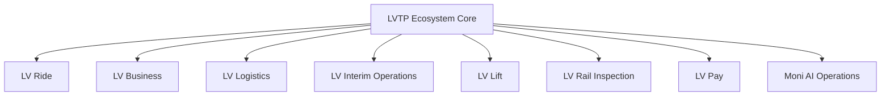
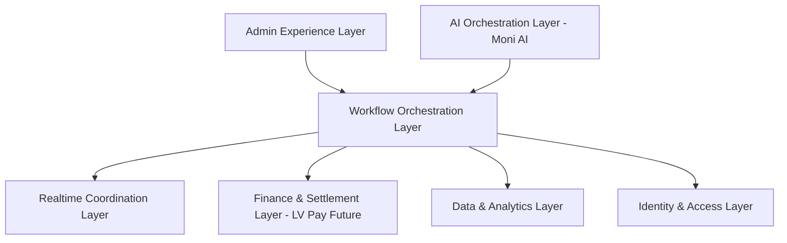
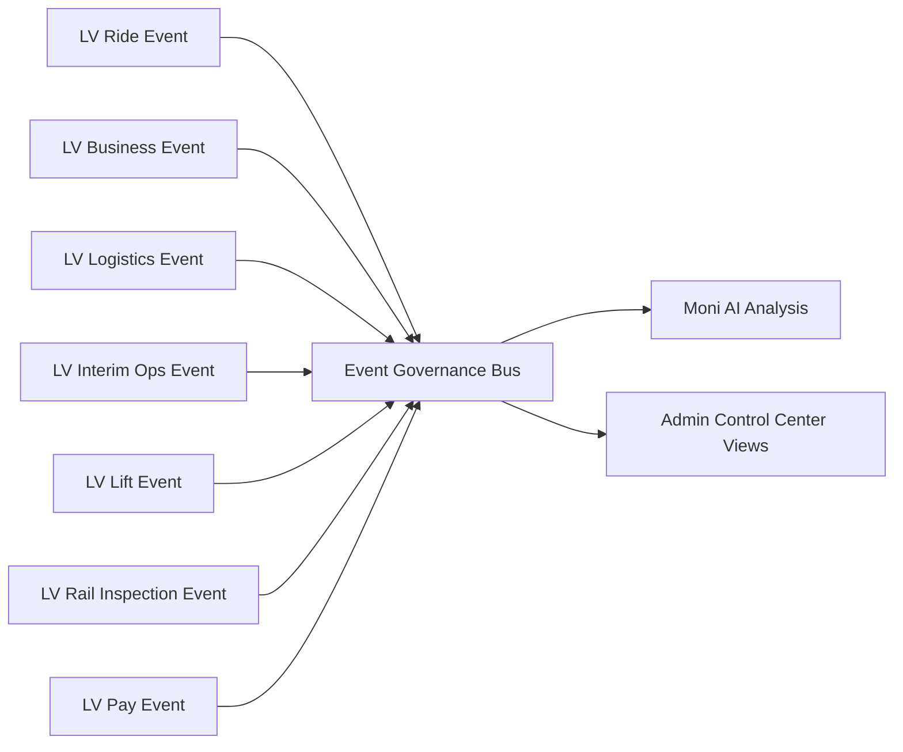
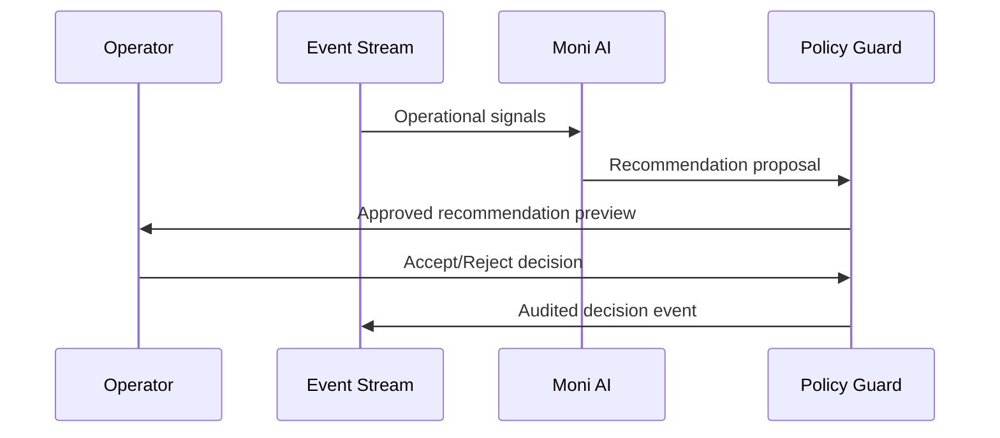
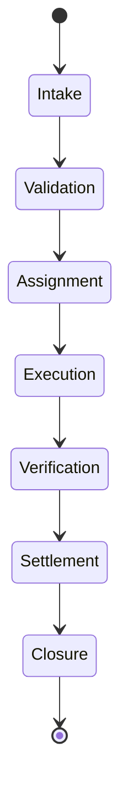

# FUTURE CONCEPT — LVTP Ecosystem Diagrams

> Concept diagrams only. No runtime integration.

## 1) Ecosystem Domain Map

## 2) Layered Modular Architecture

## 3) Conceptual Cross-Domain Event Flow

## 4) Moni AI Human-in-the-Loop Concept

## 5) Future Lifecycle Template (Generic)

