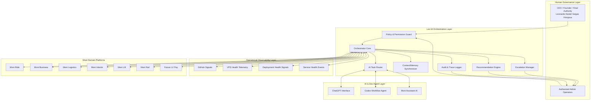
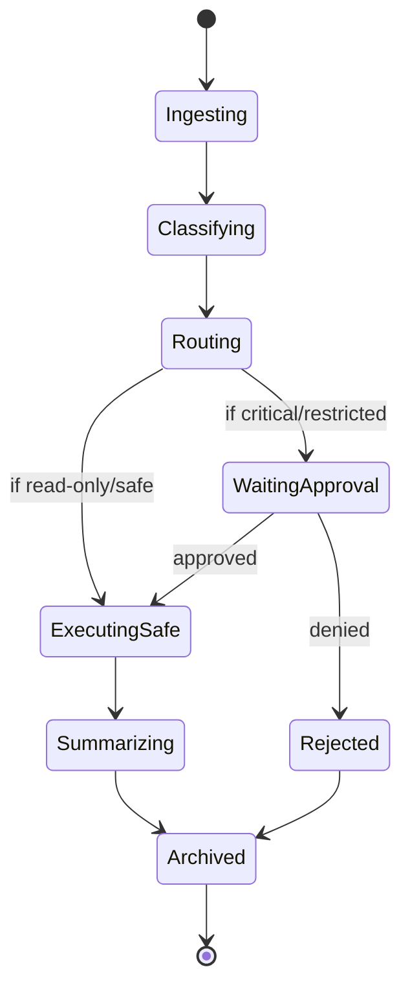
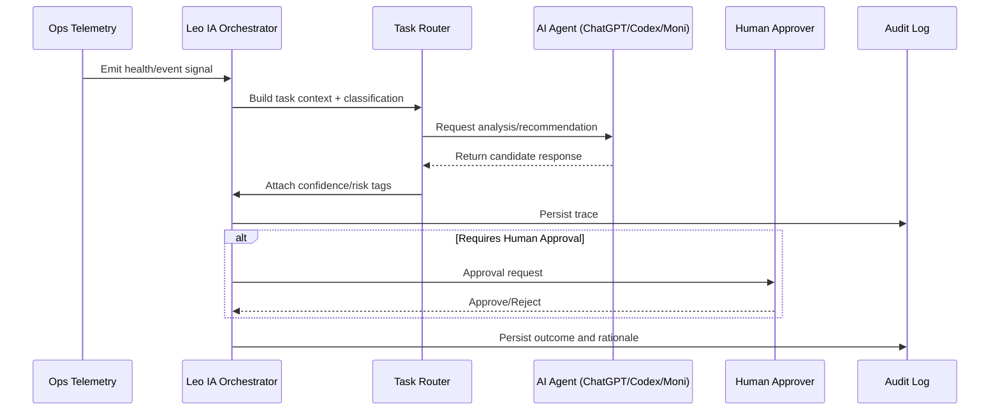

# Leo IA — Future Concept Architecture (Roadmap Only)

> **Status:** Future Concept Only (Non-Production)
> 
> **Date:** May 12, 2026
> 
> **Scope:** AI orchestration and operational coordination concepts for the LVTP ecosystem.

## 1) Purpose

Leo IA is the **future central AI orchestration layer** for LVTP. It is designed to coordinate intelligence workflows across Moni ecosystem services, engineering operations, and infrastructure visibility.

This document is conceptual only and **does not introduce production execution**.

## 2) Authority & Governance Boundary (Non-Negotiable)

### Human authority structure

- **Leonardo Daniel Vargas Hinojosa** remains:
  - CEO
  - Founder
  - Final Authority
- Leo IA operates strictly as a **support/orchestration** layer.
- Critical operational, financial, legal, infrastructure, and strategic actions require **explicit human approval**.

### Hard safety restrictions

- No autonomous execution of production actions.
- No autonomous financial operations.
- No autonomous infrastructure control.
- No AI bypass of admin authority.
- No production API coupling in this concept branch.
- No modifications to current LV Ride operations.

## 3) Conceptual Ecosystem Integration Surface

Leo IA conceptually coordinates with:

- ChatGPT
- Codex
- GitHub
- VPS infrastructure telemetry
- Moni Assistant ecosystem
- LVTP operational services

And domain systems:

- Moni Assistant
- Moni Ride
- Moni Business
- Moni Logistics
- Moni Interim
- Moni Lift
- Moni Rail
- Future LV Pay systems

## 4) Conceptual Layered Architecture



## 5) AI Orchestration Model (Concept)

### Routing classes

1. **Information Tasks** — summarize status, reports, trends.
2. **Coordination Tasks** — assign AI agents/workstreams.
3. **Recommendation Tasks** — propose human-approved actions.
4. **Escalation Tasks** — alert human operators on risk conditions.

### Orchestration principles

- Event-driven coordination first.
- Policy checks before every route.
- Human gate for any high-impact recommendation.
- Full audit lineage for all prompts, outputs, and approvals.

## 6) Lifecycle States (Future)



## 7) Multi-Agent Communication Architecture (Concept)



## 8) Conceptual Event Architecture

### Event families

- `ops.health.*`
- `ops.deploy.*`
- `ai.task.*`
- `ai.approval.*`
- `ai.escalation.*`
- `ai.audit.*`
- `analytics.snapshot.*`

### Example event flow

1. `ops.health.service.degraded` arrives.
2. Leo IA creates `ai.task.diagnose`.
3. Router assigns to best-fit AI agent.
4. Leo IA emits `ai.recommendation.generated`.
5. If critical: emit `ai.approval.requested` and await decision.
6. On decision: emit `ai.approval.approved|rejected`.
7. Emit final `ai.audit.recorded`.

## 9) Conceptual DTO / Interface Examples

```ts
// Conceptual only - not wired to production.
export type RiskLevel = 'low' | 'medium' | 'high' | 'critical';

export interface LeoTaskEnvelope {
  taskId: string;
  source: 'ops' | 'github' | 'vps' | 'moni_assistant' | 'admin';
  domain: 'ride' | 'business' | 'logistics' | 'interim' | 'lift' | 'rail' | 'lvpay' | 'platform';
  intent: 'summarize' | 'diagnose' | 'recommend' | 'coordinate' | 'escalate';
  riskLevel: RiskLevel;
  requiresHumanApproval: boolean;
  contextRefs: string[];
  createdAtIso: string;
}

export interface ApprovalRequest {
  approvalId: string;
  taskId: string;
  reason: string;
  requestedBy: 'leo_ia';
  requiredRole: 'ceo' | 'authorized_admin';
  status: 'pending' | 'approved' | 'rejected';
  decidedBy?: string;
  decidedAtIso?: string;
}

export interface AuditRecord {
  traceId: string;
  taskId: string;
  actionType: 'route' | 'recommendation' | 'approval' | 'escalation' | 'summary';
  actor: 'leo_ia' | 'agent' | 'human';
  timestampIso: string;
  metadata: Record<string, string | number | boolean>;
}
```

## 10) Operational Coordination Workflows (Future)

### A) Platform health summary workflow

- Ingest telemetry and service status.
- Generate periodic AI summary.
- Flag anomalies with severity tags.
- Send digest to human operators.

### B) GitHub/Codex workflow monitoring

- Track PR activity and CI outcomes.
- Detect failed pipelines and repeated regressions.
- Propose remediation checklist.
- Require human confirmation before any operational follow-up.

### C) Escalation workflow

- Trigger on high-risk conditions.
- Route to CEO/admin channel with structured context.
- Maintain immutable audit entry.
- Close escalation only by human decision.

## 11) Centralized AI Monitoring & Dashboard Concept

### Dashboard panels (future)

- Global ecosystem health score.
- Agent activity and queue depth.
- Approval queue and SLA timers.
- Escalation timeline.
- Domain slices (Ride/Business/Logistics/Interim/Lift/Rail/LV Pay).
- Audit integrity and policy compliance signals.

## 12) Memory / Context Synchronization (Future)

- Shared context index for active incidents and tasks.
- Tenant/domain-scoped memory partitions.
- Time-bounded context windows.
- Signed context references for auditability.
- Human-overridable context pinning.

## 13) Future Recommendation System

- Recommendations are advisory only.
- Each recommendation carries:
  - confidence score
  - risk level
  - impacted services
  - required approver role
  - rollback/mitigation notes
- No execution without explicit human approval token.

## 14) Permission Structure (Concept)

- **Read Scope:** telemetry, logs, metadata summaries.
- **Recommend Scope:** propose actions.
- **Escalate Scope:** notify human approvers.
- **Approve Scope (Human only):** authorize critical actions.
- **Execute Scope:** intentionally excluded from Leo IA concept phase.

## 15) Scalability Strategy (Future)

- Event-bus decoupled architecture.
- Domain-specific routing queues.
- Stateless orchestration workers with horizontal scaling.
- Dedicated audit pipeline with append-only storage.
- Graceful degradation to read-only summarization mode.

## 16) Future Concept Roadmap Phases

1. **Phase 0 — Conceptual Design (current branch)**
   - Define architecture, DTOs, workflows, and governance.
2. **Phase 1 — Non-production simulation**
   - Dry-run orchestration with synthetic events.
3. **Phase 2 — Read-only observability pilot**
   - Mirror health/reporting with no execution permissions.
4. **Phase 3 — Human-in-the-loop recommendation pilot**
   - Advisory outputs with strict approval gates.
5. **Phase 4 — Controlled expansion**
   - Broaden domains while preserving human final authority.

## 17) Explicit Non-Implementation Statement

This branch provides **future concept architecture and roadmap only**.

It does **not**:

- change production runtime behavior,
- modify current LV Ride operational flows,
- integrate live production AI APIs,
- deploy autonomous execution capabilities.
