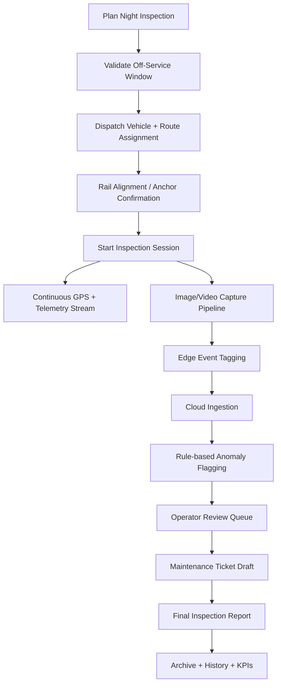
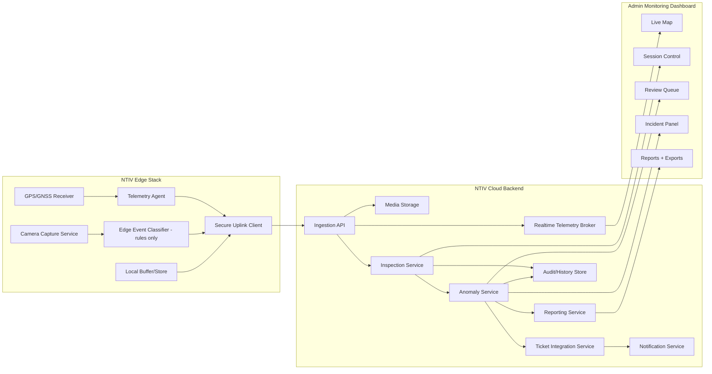
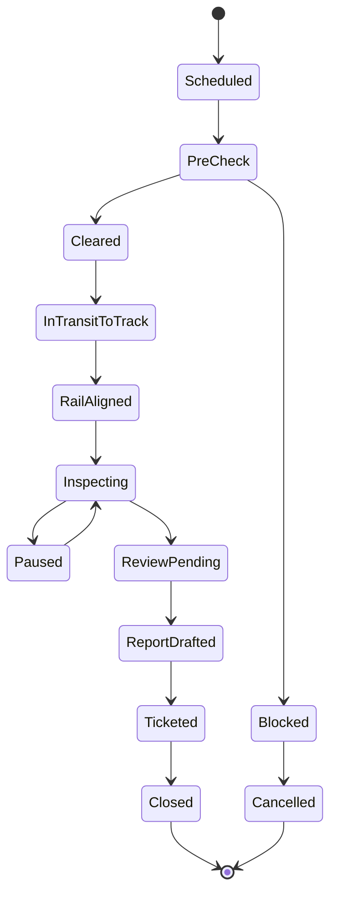

# LVTP Night Tram Inspection Vehicle (NTIV)

## 1) Purpose and Scope

This document proposes a **standalone concept architecture and operational MVP** for a smart nighttime tram rail inspection system, separate from daytime passenger ride operations in LV Transport Platform (LVTP).

### Goals
- Inspect tram rail infrastructure during off-service/night windows.
- Operate only when no tram vehicles are active on inspected lines.
- Detect visible rail risks:
  - scheuren (cracks)
  - breuken (breaks)
  - obstacles
  - track anomalies
- Capture imagery/video automatically.
- Generate inspection reports.
- Send maintenance alerts to operators (e.g., De Lijn).

### Non-goals (MVP concept boundaries)
- No production AI model training/deployment.
- No autonomous driving implementation.
- No real rail hardware control software.
- No production secrets or infra credentials.

---

## 2) Operational Concept

### Inspection Vehicle Concept
A compact inspection vehicle with:
- Hybrid road/rail guidance mode.
- Wheel anchoring/alignment mechanism for tram rail lock-in.
- Route-safe inspection mode for controlled low-speed traversal.
- GNSS/GPS tracking and telemetry uplink.
- Multi-camera rig (front, downward rail view, optional side).
- Edge compute unit for capture orchestration and pre-filtering.

### Preconditions for Night Run
1. Scheduled off-service window is active.
2. Line section receives dispatch clearance.
3. Vehicle checks pass (battery, camera health, storage, GNSS lock).
4. Operator starts run in dashboard with assigned route plan.

---

## 3) High-Level Workflow



---

## 4) System Architecture (Standalone but Integratable)



### Separation from Main LVTP Operations
- Separate namespace/services: `ntiv-*`.
- Separate datastore schemas for inspection data.
- Read-only integration bridge to core LVTP GIS route metadata.
- Optional SSO shared identity, but isolated RBAC roles.

---

## 5) Modular Software Structure (Proposed)

```text
/apps
  /ntiv-admin-dashboard
  /ntiv-ops-console
/packages
  /ntiv-domain
    inspection-session.ts
    anomaly.ts
    telemetry.ts
    maintenance-ticket.ts
  /ntiv-edge-sdk
    gps-adapter.ts
    camera-adapter.ts
    uploader.ts
  /ntiv-ingestion
    telemetry-handler.ts
    media-handler.ts
  /ntiv-inspection-engine
    route-progress.ts
    quality-checks.ts
  /ntiv-anomaly-rules
    crack-heuristics.ts
    obstacle-heuristics.ts
  /ntiv-reporting
    report-builder.ts
  /ntiv-incident
    incident-workflow.ts
  /ntiv-integrations
    de-lijn-ticket-adapter.ts
```

---

## 6) Rail Inspection Lifecycle States



State notes:
- **Blocked** if off-service clearance fails or safety precondition is unmet.
- **ReviewPending** when auto-flagged events await operator validation.
- **Ticketed** once maintenance payload is acknowledged by external system.

---

## 7) Telemetry Model (Conceptual)

### `TelemetryPoint`
- `sessionId`
- `vehicleId`
- `timestampUtc`
- `lat`, `lon`, `alt`
- `speedKph`
- `headingDeg`
- `railMode` (ROAD | RAIL)
- `anchorStatus` (UNLOCKED | LOCKING | LOCKED | ERROR)
- `cameraHealth` (OK | DEGRADED | OFFLINE)
- `connectivity` (ONLINE | INTERMITTENT | OFFLINE)
- `batteryPct`
- `storageFreeMb`

### `InspectionEvent`
- `eventId`
- `sessionId`
- `eventType` (CRACK_CANDIDATE | BREAK_CANDIDATE | OBSTACLE | TRACK_ANOMALY | SYSTEM_ALERT)
- `severity` (LOW | MEDIUM | HIGH | CRITICAL)
- `position` (lat/lon + routeChainage)
- `mediaRefs[]` (photo/video IDs)
- `confidenceHint` (rule-score placeholder for future AI)
- `reviewStatus` (AUTO_FLAGGED | VERIFIED | REJECTED)
- `createdAtUtc`, `reviewedAtUtc`

### `InspectionSessionSummary`
- `sessionId`
- `routeId`
- `startUtc`, `endUtc`
- `distanceKm`
- `coveragePct`
- `anomalyCountByType`
- `incidentCount`
- `reportId`

---

## 8) Route Recording + Coverage

### Route Logic
- Route definitions imported from tram GIS centerline.
- Route segmented into inspection checkpoints (e.g., every 10–25m).
- Coverage computed by nearest-point map matching of telemetry to route segments.

### Coverage Outcomes
- `FULL_COVERAGE` >= 98%
- `PARTIAL_COVERAGE` 80–97.99%
- `INSUFFICIENT_COVERAGE` < 80%

### Exceptions
- GPS drift segment -> mark as uncertain geometry.
- camera offline window -> coverage intact but visual quality warning.

---

## 9) Image/Video Capture Pipeline

1. Trigger capture cadence by speed + segment density.
2. Timestamp and geotag each frame/event clip.
3. Run edge quality checks (blur/exposure/obstruction).
4. Buffer locally with rolling retention.
5. Upload prioritized queue:
   - critical event media first
   - then baseline coverage media
6. Cloud links media to route segment and session timeline.

Artifacts:
- `FrameAsset` (single image)
- `ClipAsset` (short rolling clip around anomaly)
- `MediaIndex` (hash, timestamp, geolocation, route segment)

---

## 10) Anomaly Detection Preparation (Future AI-ready)

### MVP (Now)
- Rule-based heuristics only:
  - edge contrast irregularity
  - sudden geometry discontinuity cues
  - obstacle silhouette threshold
- Manual operator verification required for ticket generation.

### AI-Ready Data Contracts
- Keep normalized labels:
  - `anomalyTypeCandidate`
  - `bboxOrMaskRef` (optional placeholder)
  - `humanReviewOutcome`
- Build training-ready dataset through reviewed events.

### Future Integration Path
- Pluggable inference interface:
  - `detect(frame, context) -> candidates[]`
- Shadow mode (AI scores logged, no automation).
- Graduated trust policy by precision/recall thresholds.

---

## 11) Maintenance Reporting + Ticket Preparation

### Ticket Draft Model
- `ticketExternalRef` (nullable until acknowledged)
- `operatorOrg` (e.g., De Lijn)
- `routeId`, `trackSegmentId`
- `issueType`
- `severity`
- `recommendedAction`
- `evidenceMedia[]`
- `detectedAtUtc`
- `slaTargetUtc`
- `status` (DRAFT | SENT | ACKNOWLEDGED | IN_PROGRESS | RESOLVED)

### Workflow
1. Auto-create draft from verified anomaly.
2. Operator edits/approves.
3. Integration service posts payload to external maintenance endpoint.
4. Acknowledgement updates ticket status.
5. Report cross-links ticket lifecycle.

---

## 12) Incident Management

Incident classes:
- Safety incident (obstacle requiring urgent intervention).
- System incident (sensor or anchor failure).
- Comms incident (extended telemetry outage).

Response model:
- Open incident -> assign owner -> mitigate -> close with postmortem note.
- Incident timeline synchronized with telemetry and media artifacts.

---

## 13) Realtime Monitoring Dashboard

Views:
- Live map with vehicle position, heading, speed, route progress.
- Session panel with lifecycle state and health indicators.
- Event feed with severity filters and media preview.
- Incident panel with escalation status.
- Post-run report center and historical replay.

Role model:
- `NTIV_DISPATCHER`
- `NTIV_REVIEWER`
- `NTIV_MAINTENANCE_COORDINATOR`
- `NTIV_ADMIN`

---

## 14) Cloud/Backend Architecture (MVP)

- API gateway for session control + query.
- Streaming channel (WebSocket/MQTT bridge) for telemetry and alerts.
- Object storage for media; relational/document store for metadata.
- Time-series optimized store or partitioning for telemetry history.
- Background workers for report generation and ticket sync retries.
- Audit logging for lifecycle changes and operator actions.

Security (conceptual):
- mTLS or signed device tokens for vehicle uplink.
- RBAC + MFA for operator dashboard.
- Immutable audit trail for inspection/ticket actions.

---

## 15) Operational MVP Phases

### Phase 0 - Design & Simulation
- Define schemas, flows, dashboard wireframes.
- Simulate telemetry and media streams.

### Phase 1 - Controlled Pilot
- One route, one vehicle, one night window.
- Manual review-heavy process.
- Generate baseline KPI dashboard.

### Phase 2 - Scale-up
- Multiple routes and concurrent sessions.
- External maintenance integration hardening.
- Add AI shadow-mode scoring pipeline.

KPIs:
- route coverage %
- anomalies per km
- median review time
- ticket acknowledgement time
- false-positive rate after human review

---

## 16) Example End-to-End Night Run

1. 22:30 UTC: session scheduled and cleared.
2. 22:45 UTC: vehicle rail-aligned and inspection starts.
3. 23:10 UTC: obstacle candidate detected (HIGH), alert pushed.
4. 23:13 UTC: reviewer verifies event, ticket drafted.
5. 23:20 UTC: ticket sent to maintenance operator.
6. 00:15 UTC: route coverage reaches 99.1%, session ends.
7. 00:25 UTC: final report generated and archived.

---

## 17) Deliverables Summary for Concept Approval

- Standalone NTIV architecture and workflow.
- Data contracts for telemetry, anomalies, sessions, tickets.
- Lifecycle/state model for operations.
- Realtime dashboard scope and RBAC.
- AI-readiness plan without deploying AI in MVP.

This concept is intentionally implementation-agnostic and suitable as a blueprint for detailed technical design, pilot planning, and stakeholder alignment with municipal operators such as De Lijn.
